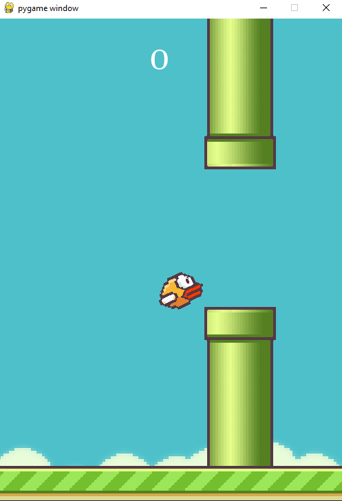

⚠️ Project in conclusion

<h1 align="center">Flappy Bird</h1>
<h1 align="center"></h1>
  
<h3 align="center">Application developed with <a href="">@Hashtag Programação</a> during the program "Python Impressionador".</h3>

## 👨‍💻 Technologies
<p display="block" align="left">
  <a href="https://www.python.org/">Python</a>&nbsp;&nbsp;&nbsp;|&nbsp;&nbsp;
  <a href="https://www.pygame.org/news">Pygame</a>
</p>

## ✏️ Run the application 

Execute ```pip install pygame```, ```pip install pyos``` and ```pip install pyrandom``` in your IDE's terminal.

Click on ▶️.
  
## 💻 About the project
<p align="center">
  
</p>


---  

<h4 align="center"> <em>&lt;/&gt;</em> by <a href="https://github.com/PhOmena" target="_blank">PhOmena</a></h4>
